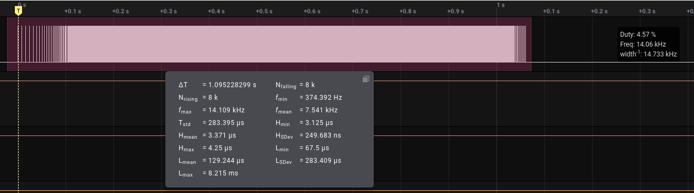
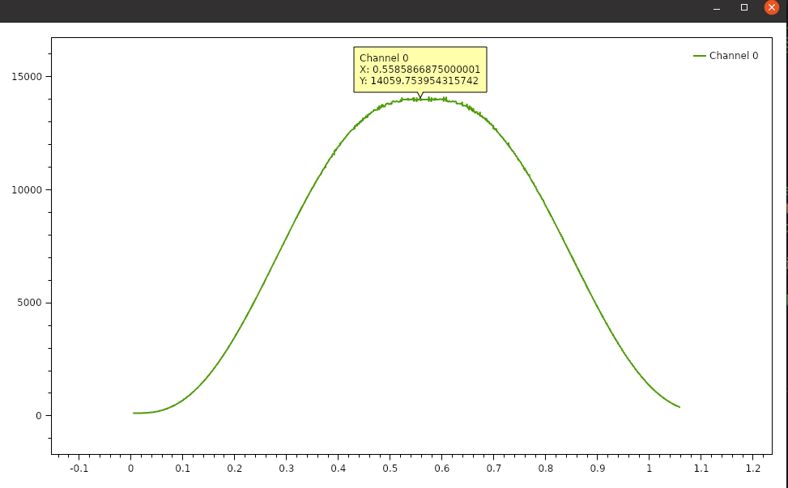

# shu

[](https://www.nuget.org/packages/shu/)

SHell Utilities

<hr/>

<!-- TOC -->
- [shu](#shu)
  * [Quickstart](#quickstart)
  * [enable completion](#enable-completion)
  * [command line](#command-line)
    + [match regex](#match-regex)
    + [replace token](#replace-token)
    + [cpu autolimiter](#cpu-autolimiter)
    + [graph-area](#graph-area)
  * [How this project was built](#how-this-project-was-built)
<!-- TOCEND -->

<hr/>

## Quickstart

- Requirements: [Download NET Core SDK](https://dotnet.microsoft.com/download)
- Install the tool:

```sh
dotnet tool update -g shu
```

- if `~/.dotnet/tools` dotnet global tool isn't in path it can be added to your `~/.bashrc`

```sh
echo 'export PATH=$PATH:~/.dotnet/tools' >> ~/.bashrc
```

## enable completion

to enable completion edit `/etc/bash_completion.d/shu`

```sh
_fn() {  
        COMPREPLY=($(SHOW_COMPLETIONS=1 shu ${COMP_LINE:2}))
}
complete -F _fn shu
```

## command line

```sh
devel0@main:~$ shu
missing command

Usage: shu COMMAND FLAGS

shell utils

Commands:
  replace-token   replace token from given standard input (not optimized for huge files)

Global flags:
  -h              show usage
```

### match regex

```sh
Usage: shu match-regex FLAGS regex fmt

match regex groups

Global flags:
  -h,--help   show usage

Parameters
  regex       c# regex
  fmt         format string ( use \N to print Nth group in place )
```

**example**

```sh
devel0@tuf:/opensource/shu$ acpi -b
Battery 0: Unknown, 97%
devel0@tuf:/opensource/shu$ acpi -b | shu match-regex '[,\s]*(\d+)%' 'battery percent is [\\1]'
battery percent is [97]
```

### replace token

```sh
Usage: shu replace-token FLAGS token replacement

replace token from given standard input (not optimized for huge files)

Optional flags:
  -csregex      token will treated as csharp regex

Global flags:
  -h,--help     show usage

Parameters
  token         token to search for
  replacement   text to replace where token was found
```

[**example**](https://github.com/devel0/security-manager/blob/8ed0f574fa649d5131d2ea2ea8e2dea5338500d2/docker/Dockerfile#L49-L52)

### cpu autolimiter

- requirements:

```sh
apt-get -y install cpulimit cpustat
```

- example:

```sh
$ shu cpu-autolimiter
process pid=29696 with cpu=54.46% will limited to cpu=20% [/opt/google/chrome/nacl_helper]
$ ps ax | grep cpulimit
20693 ?        S      0:00 cpulimit --background --pid 29696 --limit 20
```

### logic2-freq-graph

from [Logic2](https://github.com/saleae/logic2-extensions) csv export generate a frequency graph.

Follow example is recording of "G0 X10" within [Marlin](https://github.com/MarlinFirmware/Marlin) configured to use SCurve motion.



this is the output of the command

```sh
shu logic2-freq-graph ~/t/digital.csv "Channel 0"
```



### graph-area

compute area under graph from given points xy file ( [example input file](data/graph-area/sample.txt) )

```sh
Usage: shu graph-area FLAGS filename

compute area under graph XY

Optional flags:
  -d=VAL      decimal separator (default=.)
  -f=VAL      field separator (default=,)
  -x          generate dxf lwpolyline output

Global flags:
  -h,--help   show usage

Parameters
  filename    simple XY column file
```

```sh
$ shu graph-area -x -d . -f , shu/data/graph-area/sample.txt
area: 380.7128486182038
[/home/devel0/Documents/opensource/shu/data/graph-area/sample.dxf] written.
```

## How this project was built

```sh
mkdir shu
cd shu

dotnet new sln
dotnet new console -n shu

cd shu
dotnet add package netcore-util --version 1.7.1
dotnet add package netcore-cmdline --version 0.3.1
dotnet add reference ../../netDxf/netDxf
cd ..

dotnet sln shu.sln add shu
dotnet build
./shu/bin/Debug/net5.0/shu
```

note: netDxf from [this repo](https://github.com/haplokuon/netDxf/tree/net_5.0) net_5.0 branch